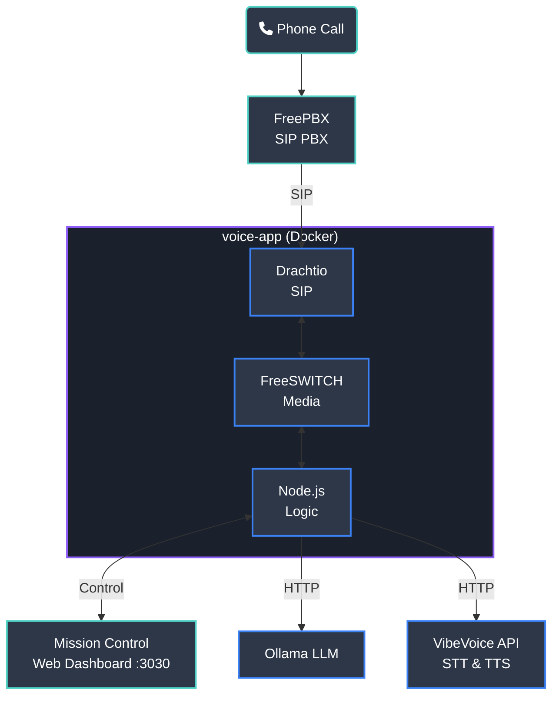

<p align="center">
  
</p>

# AI Phone

Voice interface via SIP — call your local AI, and your AI can call you. **100% private. No cloud APIs required.**

## What is this?

AI Phone gives your local AI a phone number through FreePBX:

- **Inbound**: Call an extension and talk to your local AI
- **Outbound**: Your server calls YOU with alerts, then has a conversation
- **Streaming AI**: Responses stream sentence-by-sentence for natural pacing with thinking phrases and hold music
- **Call Recordings**: Every call is automatically recorded and available in Mission Control
- **Mission Control**: Web dashboard at `http://<your-server-ip>:3030` to monitor status, play recordings, and initiate calls

## How it works



## Prerequisites

| Component | Software |
|-----------|----------|
| PBX | [FreePBX](https://www.freepbx.org/) or any SIP provider |
| LLM | [Ollama](https://ollama.com/) with a chat model (default: `gemma4:2b`) |
| STT | [VibeVoice-ASR](https://github.com/microsoft/VibeVoice) running in the unified python API (CUDA recommended) |
| TTS | [VibeVoice-Realtime](https://github.com/microsoft/VibeVoice) running in the unified python API (CUDA recommended) |
| Runtime | Docker + Node.js 18+ |

> **No API keys needed.** No data ever leaves your machine.

### Proxmox LXC Guidelines (Crucial)

If you are deploying AI Phone on a Proxmox LXC container instead of bare-metal Linux or a full VM:
1. **Must be a Privileged Container**: Uncheck the "Unprivileged container" box when creating the LXC. Unprivileged LXCs aggressively block Docker's `overlay2` storage driver from establishing SQLite database locks, causing the FreeSWITCH container to eternally hang during boot. Privileged containers natively support Docker volumes and direct GPU passthrough without hacking cgroups.
2. **CPU Type must be `host`**: FreeSWITCH mathematically requires **AVX instructions** to process raw audio streams. If your machine's physical CPU supports AVX, but your Proxmox VM is set to a masked CPU architecture (like `kvm64`), FreeSWITCH will instantly silently crash with an "Illegal Instruction" (`SIGILL`).

### Nvidia GPU Passthrough (Docker)

If you are passing an Nvidia GPU (like a Tesla T400) to offload the heavy VibeVoice ASR and TTS models, standard Docker is not enough. You must formally install the [Nvidia Container Toolkit](https://docs.nvidia.com/datacenter/cloud-native/container-toolkit/latest/install-guide.html) bridge:

```bash
# 1. Add the official Nvidia toolkit repository
curl -fsSL https://nvidia.github.io/libnvidia-container/gpgkey | gpg --dearmor -o /usr/share/keyrings/nvidia-container-toolkit-keyring.gpg \
  && curl -s -L https://nvidia.github.io/libnvidia-container/stable/deb/nvidia-container-toolkit.list | \
    sed 's#deb https://#deb [signed-by=/usr/share/keyrings/nvidia-container-toolkit-keyring.gpg] https://#g' | \
    tee /etc/apt/sources.list.d/nvidia-container-toolkit.list

# 2. Install and bind the Docker runtime
apt-get update && apt-get install -y nvidia-container-toolkit
nvidia-ctk runtime configure --runtime=docker
systemctl restart docker

# 3. Now `ai-phone start` will successfully allocate hardware access!
```

## Quick Start

```bash
# 1. Install
curl -sSL https://raw.githubusercontent.com/jayis1/Project-Ph-sidestepping/vibevoice-integration/install.sh | bash

# 2. Configure (select which Docker containers run on this machine)
ai-phone setup

# 3. Run
ai-phone start              # Start all configured services
# or
ai-phone start freeswitch   # Start specific services only

# 4. Open Mission Control
# Navigate to http://<your-server-ip>:3030
```

## Setup Wizard prompts

| Prompt | Example |
|--------|---------|
| SIP Domain | `172.16.1.163` |
| SIP Registrar | `172.16.1.163` |
| Extension | `9001` |
| SIP Password | `mysecret` |
| External IP | `172.16.1.163` |
| Ollama API URL | `http://host.docker.internal:11434` |
| Ollama Model | `gemma4:2b` |
| Local STT URL | `http://host.docker.internal:8080/v1` |
| Local TTS URL | `http://host.docker.internal:8080/v1/audio/speech` |
| Bot Name | `Trinity` |
| System Prompt | `You are Trinity...` |

## CLI Commands

```bash
ai-phone setup              # Interactive configuration wizard
ai-phone start              # Launch all configured Docker containers
ai-phone start <services>   # Launch specific containers (e.g. freeswitch voice-app)
ai-phone stop               # Stop services
ai-phone stop <services>    # Stop specific containers
ai-phone status             # Check container and SIP status
ai-phone doctor             # Run health checks
ai-phone logs               # Tail logs
```

## Advanced: Distributed Multi-Node Architecture

```text
┌──────────────────────────────────────────────────────────────┐
│                     Enterprise LAN                           │
│                                                              │
│  ┌──────────────────────────────────────────────────┐        │
│  │ Server 1: The PBX Core (Modern AVX CPU Required) │        │
│  │ Handles raw SIP routing and media bridging.      │        │
│  │ - FreePBX (SIP Gatekeeper)                       │        │
│  │ - Drachtio (SIP Signalling)                      │        │
│  │ - FreeSWITCH (Real-Time Audio Engine)            │        │
│  │ - VoiceApp (Mission Control & Call Logic)        │        │
│  └───────────────────────┬──────────────────────────┘        │
│                          │ HTTP APIs over local network      │
│            ┌─────────────┴─────────────┐                     │
│            ↓                           ↓                     │
│  ┌────────────────────┐   ┌───────────────────────────┐      │
│  │ Server 2: Brains   │   │ Server 3: Ears & Voice    │      │
│  │ - Ollama (LLMs)    │   │ - VibeVoice API           │      │
│  └────────────────────┘   └───────────────────────────┘      │
└──────────────────────────────────────────────────────────────┘
```

The AI Phone is designed as a suite of decoupled microservices. You can run all of the containers on one machine, or split them across a cluster.

During `ai-phone setup`, use the `Spacebar` to Check/Uncheck the exact containers you want running on that specific Linux instance.

**Example 3-Node Enterprise Split:**
1. **Server 1 (PBX Core)**: Runs your base FreePBX instance. Under `ai-phone setup`, check `SIP Signaling`, `Media Engine`, and `Voice Application Logic`. (Voice-App and FreeSWITCH must share a node to perform instant local disk volume audio handoffs).
2. **Server 2 (Brains - GPU)**: Pure Ollama server running Llama3/Deepseek models.
3. **Server 3 (VibeVoice API - GPU)**: Dedicated box running the `vibevoice-api` container to offload heavyweight STT and TTS inference.

## Mission Control

A web dashboard is served at **port 3030** when the voice-app is running. It provides:

- **System Status** — live view of Drachtio (SIP) and FreeSWITCH (media) connectivity
- **Device List** — all registered extensions and their voice configs
- **Outbound Calls** — initiate outbound calls to any phone number from the browser
- **Call Recordings** — playback and download recorded conversations
- **Call History** — track completed, failed, and active calls in real-time
- **Live Logs** — scrolling log view of all voice-app activity

### Initiating an Outbound Call

1. Open Mission Control at `http://<your-server-ip>:3030`
2. Enter the target phone number (e.g. `+4531426562`)
3. Select a device/extension from the dropdown
4. Enter the AI context message (what Trinity should say)
5. Click **Initiate Call**

The AI will call the target number, speak the context message, then enter conversation mode.

### Outbound Call API

```bash
curl -X POST http://localhost:3000/api/outbound-call \
  -H "Content-Type: application/json" \
  -d '{
    "to": "+4531426562",
    "message": "Hey, your server CPU is at 95%. Want me to investigate?",
    "device": "Trinity",
    "mode": "conversation"
  }'
```

## Recommended AI Models

| Model | Size | RAM | Best for |
|-------|------|-----|----------|
| `gemma4:2b` | ~1.5GB | ~3GB | **Default** — extremely fast, efficient edge model for quick conversational response |
| `gemma4:4b` | ~2.5GB | ~4GB | Great balance of speed and enhanced reasoning |
| `deepseek-r1:8b` | 4.9GB | ~6GB | Chain-of-thought reasoning for complex tasks |
| `llama3.1:8b` | 4.7GB | ~6GB | Reliable alternative for general conversation |

```bash
# Switch models
ollama pull gemma4:2b
# Update OLLAMA_MODEL in your .env, then:
docker rm -f voice-app; docker compose up -d --build voice-app
```

## Local AI Setup Tips

### Ollama
```bash
ollama pull gemma4:4b
ollama serve   # Already runs on :11434 by default
```

### VibeVoice Custom API (STT & TTS)
Included in Docker Compose — starts automatically with `ai-phone start`.

The `vibevoice-api` container runs both VibeVoice-ASR and VibeVoice-Realtime-0.5B powered by a FastAPI wrapper, exposing OpenAI-compatible endpoints on port `8080`. **A GPU with sufficient VRAM is heavily recommended to run both models simultaneously.**

```bash
# Test TTS independently
curl http://localhost:8080/v1/audio/speech \
  -X POST -H 'Content-Type: application/json' \
  -d '{"input":"Hello world","model":"vibevoice","voice":"af_heart","response_format":"wav"}' \
  --output test.wav
```

## Network & Port Configuration

| Port | Service | Notes |
|------|---------|-------|
| 3000 | Voice App HTTP | Audio files, outbound API |
| 3030 | Mission Control | Web dashboard |
| 5060 | FreePBX/Asterisk | SIP signaling (PBX) |
| 5070 | Drachtio | SIP signaling (voice-app) |
| 30000-30100 | FreeSWITCH | RTP media (audio) |

> **Important:** Drachtio uses port **5070** to avoid conflict with FreePBX on 5060. All containers run in `host` networking mode.

## Environment Variables

See [`.env.example`](.env.example) for all configurable variables. Key ones:

| Variable | Purpose |
|----------|---------|
| `EXTERNAL_IP` | Server LAN IP for RTP routing |
| `OLLAMA_API_URL` | URL to Ollama instance |
| `OLLAMA_MODEL` | Chat model to use (default: `gemma4:2b`) |
| `LOCAL_TTS_URL` | VibeVoice Custom TTS API endpoint (default: `http://127.0.0.1:8080/v1/audio/speech`) |
| `LOCAL_STT_URL` | VibeVoice Custom STT API endpoint (default: `http://127.0.0.1:8080/v1`) |
| `SIP_DOMAIN` | FreePBX server FQDN or IP |
| `SIP_REGISTRAR` | SIP registrar address |
| `DRACHTIO_SIP_PORT` | Drachtio SIP port (default: `5070`) |

## FreePBX Configuration (Critical)

### SIP Trunk Settings

For outbound PSTN calls, your SIP trunk needs `from_user` and `from_domain` set. Configure in **Connectivity → Trunks → [Your Trunk] → pjsip Settings → Advanced**:

| Setting | Value | Why |
|---------|-------|-----|
| `From Domain` | Your provider domain (e.g. `voice.redspot.dk`) | Required by SIP provider for authentication |
| `From User` | Your trunk account ID (e.g. `12345678`) | Required by SIP provider for caller identification |

Also ensure the outbound route has a dial pattern of `.` (matches all numbers) with your trunk selected.

### RTP Timeout (Prevents 32-Second Call Drops)

FreePBX defaults `rtp_timeout=30` in `/etc/asterisk/pjsip.endpoint.conf`, which kills calls after 30 seconds if FreePBX doesn't receive RTP. This must be disabled for AI calls (where silence is normal during processing):

```bash
# Persist across FreePBX config reloads
echo -e "rtp_timeout=0\nrtp_timeout_hold=0" >> /etc/asterisk/pjsip.endpoint_custom.conf
asterisk -rx "module reload res_pjsip.so"

# Verify
asterisk -rx "pjsip show endpoint YOUR_EXTENSION" | grep rtp_timeout
```

> **Warning:** Without this, outbound calls will consistently disconnect at exactly ~32 seconds.

### Extension Settings

For the AI extension (e.g. 9001), set in **Admin → Extensions → [Extension] → Advanced**:

| Setting | Value | Why |
|---------|-------|-----|
| `Direct Media` | **No** | FreePBX must stay in the media path to bridge audio between FreeSWITCH and the SIP trunk |
| `RTP Timeout` | **0** | Prevents premature call termination during AI processing |


## Documentation

- [cli/README.md](cli/README.md) - CLI reference
- [docs/TROUBLESHOOTING.md](docs/TROUBLESHOOTING.md) - Common issues
- [voice-app/DEPLOYMENT.md](voice-app/DEPLOYMENT.md) - Production deployment
- [voice-app/README-OUTBOUND.md](voice-app/README-OUTBOUND.md) - Outbound call API
